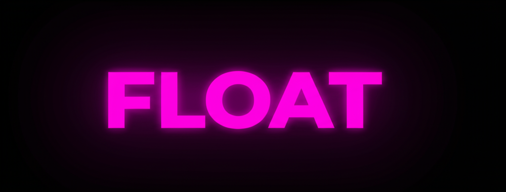
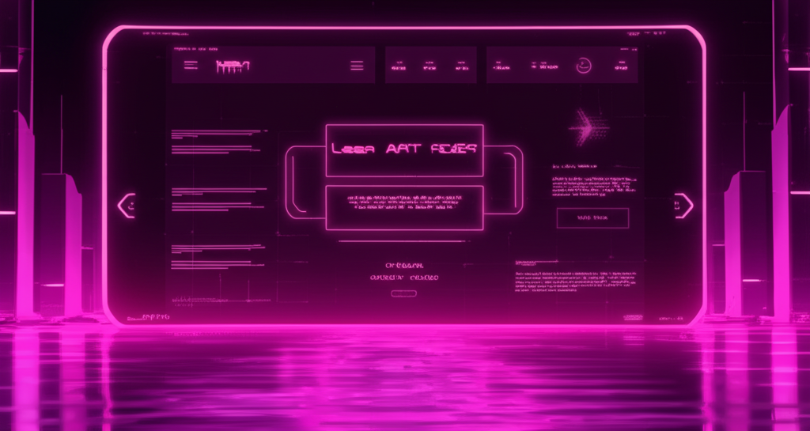

# FLOAT Portfolio Website



A modern portfolio website with digital garden and blog functionalities, featuring a cyberpunk-inspired aesthetic with a distinctive magenta/pink on black color scheme.

## ✨ Features

- **Striking Cyberpunk Design**: Distinctive magenta/pink on black color scheme with animated elements
- **Responsive Layout**: Fully responsive design that works on all devices
- **Portfolio Showcase**: Highlight your projects with detailed descriptions and images
- **Digital Garden**: Interactive knowledge system with interconnected notes and concepts
- **Graph Visualization**: Visual representation of connections between different garden nodes
- **Blog System**: Publish and categorize blog posts with tags
- **Terminal-Inspired UI**: Command-line inspired interfaces for a unique user experience

## 📸 Screenshots

<div align="center">
  
  
</div>

## 🚀 Getting Started

### Prerequisites

- Node.js 18.0.0 or later
- npm or yarn

### Installation

1. Clone the repository:
   \`\`\`bash
   git clone https://github.com/yourusername/float-portfolio.git
   cd float-portfolio
   \`\`\`

2. Install dependencies:
   \`\`\`bash
   npm install
   # or
   yarn install
   \`\`\`

3. Start the development server:
   \`\`\`bash
   npm run dev
   # or
   yarn dev
   \`\`\`

4. Open [http://localhost:3000](http://localhost:3000) in your browser to see the result.

## 📁 Project Structure

```
float-portfolio/
├── app/                  # Next.js app directory
│   ├── blog/             # Blog pages
│   ├── garden/           # Digital garden pages
│   ├── projects/         # Project showcase pages
│   ├── layout.tsx        # Root layout
│   ├── page.tsx          # Home page
│   └── globals.css       # Global styles
├── components/           # React components
│   ├── digital-garden/   # Digital garden components
│   ├── ui/               # UI components (shadcn/ui)
│   ├── footer.tsx        # Footer component
│   └── header.tsx        # Header component
├── lib/                  # Utility functions
├── public/               # Static assets
│   └── images/           # Images
├── docs/                 # Documentation
├── README.md             # Project overview
└── package.json          # Project dependencies
```

## 🛠️ Built With

- [Next.js](https://nextjs.org/) - React framework
- [React](https://reactjs.org/) - JavaScript library for building user interfaces
- [TypeScript](https://www.typescriptlang.org/) - Typed JavaScript
- [Tailwind CSS](https://tailwindcss.com/) - Utility-first CSS framework
- [shadcn/ui](https://ui.shadcn.com/) - UI component library
- [D3.js](https://d3js.org/) - Data visualization library for the graph view

## 📚 Documentation

For more detailed information, check out the documentation in the `docs/` directory:

- [Setup and Configuration](docs/setup.md)
- [Component Documentation](docs/components.md)
- [Styling Guide](docs/styling.md)
- [Digital Garden Documentation](docs/digital-garden.md)
- [Blog System](docs/blog.md)
- [Customization Guide](docs/customization.md)
- [Deployment Guide](docs/deployment.md)
- [Troubleshooting](docs/troubleshooting.md)

## 🤝 Contributing

Contributions are welcome! Please feel free to submit a Pull Request.

1. Fork the repository
2. Create your feature branch (`git checkout -b feature/amazing-feature`)
3. Commit your changes (`git commit -m 'Add some amazing feature'`)
4. Push to the branch (`git push origin feature/amazing-feature`)
5. Open a Pull Request

## 📄 License

This project is licensed under the MIT License - see the [LICENSE](LICENSE) file for details.

## 🙏 Acknowledgments

- Inspired by the FLOAT concept and cyberpunk aesthetics
- UI design influenced by terminal interfaces and digital gardens
- Special thanks to the open source community for the amazing tools that made this project possible
